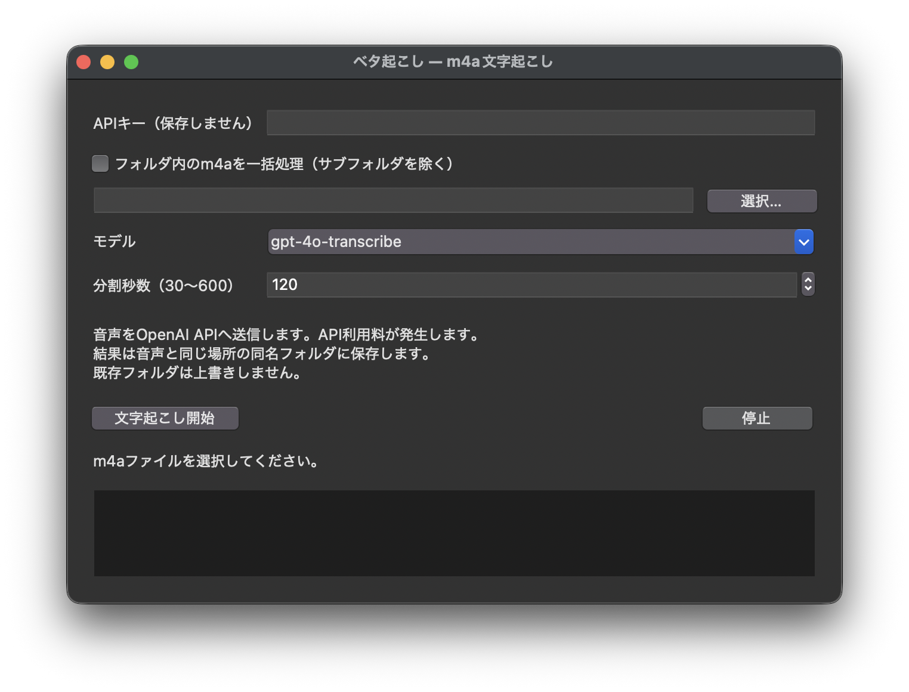

# ベタ起こしGUI / betagaki-transcriber-gui

m4a音声をOpenAI Audio APIで日本語のテキストへ変換するPython/Tkinterアプリです。
Windows/macOS向け。OpenAIの公式アプリではありません。

**公開準備版**：以前の会話に記載された仕様をもとに再実装しています。元のGUIソースとの同一性は未確認です。
2026-09-22に利用者からmacOSでの動作確認完了の報告を受領しました。
Windowsでの手動操作確認と詳細な試験記録は未完了です（[検証状況](docs/VALIDATION.md)）。

## アプリ画面



macOSでの表示例です。Windowsでは外観が異なる場合があります。

## 機能

- m4a単体、または指定フォルダ直下のm4aを一括処理（大文字拡張子にも対応）
- APIキーのマスク入力。アプリはキーをファイルへ保存しません
- `gpt-4o-transcribe` / `gpt-4o-mini-transcribe` を選択
- ffmpegでモノラル16kHz・64kbpsのMP3へ分割して順に送信
- 要約・話者名・時刻を付けない日本語文字起こしを指示
- 途中結果保存、停止ボタン、既存出力の上書き防止

分割は既定120秒（30〜600秒で指定可能）。長い区間では応答長の制限や発話の密度により欠落する可能性があるため、短めを推奨します。
文字起こしには誤り・欠落・無音部分の誤認識があり得ます。完全な逐語記録は保証しません。

## 必要なもの

- Python 3.10以上（3.12推奨）とTkinter
- ffmpeg（PATHから実行可能なこと）
- OpenAI APIキーとAPI利用可能なアカウント
- インターネット接続

音声はOpenAI APIへ送信され、利用者のアカウントにAPI利用料が発生します。
送信する権利や同意を確認した音声だけを使用してください。料金は固定値を掲載せず、[公式料金](https://developers.openai.com/api/docs/pricing)をご確認ください。
キーは[OpenAI Platform](https://platform.openai.com/api-keys)で管理します。このリポジトリやIssueに貼り付けないでください。

## Windowsでの準備

[Python公式](https://www.python.org/downloads/)からPythonを導入します。Tkinterを含めてインストールしてください。
PowerShellでこのREADMEのあるフォルダへ移動して実行します。

```powershell
py -3 -m venv .venv
.\.venv\Scripts\python.exe -m pip install -r requirements.txt
winget install --id Gyan.FFmpeg -e
```

ffmpeg導入後はターミナルを開き直してください。

```powershell
ffmpeg -version
.\.venv\Scripts\python.exe -m tkinter
```

Tkinterの確認用ウィンドウが開けば、GUIの動作環境の確認は完了です。
ウィンドウ内の「Quit」を押して閉じ、ターミナルに戻ってから次のコマンドで文字起こしアプリを起動してください。

```powershell
.\start_gui_windows.bat
```

`py`がない場合は、Pythonのインストールを確認するか、最初のコマンドを`python -m venv .venv`に置き換えます。
起動用batのダブルクリックも可能です。仮想環境の有効化は不要です。

## macOSでの準備

Tkinterを含む[Python公式インストーラー](https://www.python.org/downloads/macos/)を利用する方法が簡単です。
ターミナルでこのREADMEのあるフォルダへ移動します。

```bash
python3 -m venv .venv
.venv/bin/python -m pip install -r requirements.txt
brew install ffmpeg
chmod +x start_gui_mac.command
ffmpeg -version
.venv/bin/python -m tkinter
```

Tkinterの確認用ウィンドウが開けば、GUIの動作環境の確認は完了です。
ウィンドウ内の「Quit」を押して閉じ、ターミナルに戻ってから次のコマンドで文字起こしアプリを起動してください。

```bash
./start_gui_mac.command
```

`brew`がない場合、[Homebrew](https://brew.sh/)を導入するか、下記のConda手順を使用します。
`_tkinter`が見つからない場合はTkinter対応のPythonで仮想環境を作り直してください。
Finderから起動してffmpegが見つからない場合は、上のターミナルから起動してください。

### Anaconda / Miniconda（Windows・macOS）

Anaconda PromptまたはConda初期化済みターミナルで実行します。

```bash
conda create -n betagaki -c conda-forge python=3.12 tk ffmpeg
conda activate betagaki
python -m pip install -r requirements.txt
python transcribe_betagaki_gui.py
```

Conda利用時はこの直接起動が確実です。起動ファイルは`.venv`を最優先に使い、次に有効なConda環境を使います。

## 操作

1. APIキーを入力します。空欄の場合は環境変数`OPENAI_API_KEY`を読みます（`.env`の自動読込はしません）。
2. 単体ファイルを選ぶか、「一括処理」にチェックを入れてフォルダを選びます。
3. モデル・分割秒数を選び、「文字起こし開始」を押します。
4. 件数・外部送信・課金の確認後に処理が始まります。開始後、キー入力欄は空になります。
5. 完了後、元の音声の隣に作成されたフォルダを開きます。

```text
音声の保存場所/
  sample.m4a
  sample/
    sample.txt            # 完了時
    sample.partial.txt    # 失敗・停止時の処理済み部分（作成前に失敗する場合もあります）
    _chunks_.../           # 処理中だけ存在する一時音声
```

正常終了時はpartialを削除します。既存の`sample/`がある場合は処理を拒否します。
再実行する場合は結果をリポジトリ外へ退避するか、入力音声名を変更してください。自動再開はなく最初から処理され、再度課金されます。
停止は分割中なら速やかに、API通信中なら応答・タイムアウト後に反映します。送信済み通信の課金は取り消せません。
アプリの正常な終了・失敗・停止では一時音声を削除します。強制終了・電源断では残る場合があります。

## エラーとデータ保護

- ffmpeg未検出：導入とPATHを確認し、ターミナルを開き直す
- APIキー／権限：正しいキーとモデル利用権限を確認する
- 利用上限／残高：OpenAI Platformで確認する
- 分割失敗：再生可能なm4aか、書込権限と空き容量があるか確認する
- SDK未導入：起動に使うPythonで`-m pip install -r requirements.txt`を実行する

生のAPIエラー・レスポンス・音声名はログに保存しません。GUIのエラー番号は入力をファイル名順に並べた順番です。
SDKによる自動リトライは無効です。通常のファイルエラーは次へ進み、認証・権限・利用上限エラーは一括処理を打ち切ります。
APIキー・音声・結果はリポジトリ外で管理してください。
`.gitignore`は公開可能なソース・文書だけを許可する方式です。既に追跡されているファイルや文書に貼った秘密情報は除外できないため、公開チェックも実施します。

## テストと公開・保守

```bash
python -m unittest discover -s tests -v
python scripts/check_publication.py
```

通常テストはAPIキー不要・API通信なし。ffmpegがある環境では、一時領域に人工音声を生成して分割を検証します。
新規リポジトリの公開手順は[公開手順](docs/PUBLISHING.md)、Codex向けの作業候補は[Issue原稿](docs/issues/01-initial-publication.md)と[保守ガイド](AGENTS.md)にあります。
GitHub ActionsではWindows/macOSのテストを実行する構成です。CI設定の追加だけではCI実行済みを意味しません。

## 仕様の参照

- [OpenAI 音声文字起こしガイド](https://developers.openai.com/api/docs/guides/speech-to-text)
- [Python APIリファレンス](https://developers.openai.com/api/reference/python/resources/audio/subresources/transcriptions/methods/create)

MIT License。詳細は[LICENSE](LICENSE)を参照してください。
